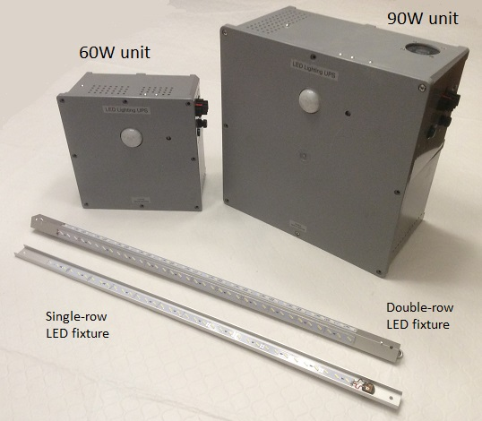

# LED Lighting UPS

The LED Lighting UPS system provides backup lighting for a study room when the AC power goes down.

It can also be used as the primary lighting source for a room that has no existing AC-powered lighting.

Being a UPS, it auto-switches to its internal battery when the AC power goes down, and back to AC when
it comes back up. While the AC power is on it keeps the battery charged.

